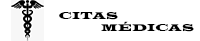

Sistema de citas medicas desarrollada en Laravel, utilizando PHP  Version 8.1

## Instalacion
- Instale un servidor local como XAMPP o WAMP que incluya PHP, MySQL y Apache.
- Primero se instala las dependencias de Composer.
<code>composer install</code>
- Luego se instalan las dependencias de Node.js
<code>npm install</code>
- Genera el Key para la aplicion.
<code>php artisan key:generate</code>
- Se crea la base de datos y las tablas.
<code>php artisan migrate</code>
- Por último se generan los datos con los seeders.
<code>php artisan db:seed</code>

## El porque utilizamos Laravel
- Utilizamos Laravel en la cual es un framework PHP de código abierto para desarrollo de aplicaciones web. Es uno de los más populares y utilizados en la actualidad, Lavarel nos ayuda desarrollar una aplicación mediante su sistema de paquetes dado que el framework es del tipo MVC (Modelo-Vista-Controlador) nos permite relajarnos en ciertos aspectos del desarrolló, como instancias clases y métodos para usarlos en muchas partes de nuestro código sin necesidad de escribirlo y repetirlo permitiendo su limpia reutilización. Desde la línea de comandos existe el famoso Artisan que es el nombre de su interfaz de comandos que ejecuta muchas de las funcionalidades como son crear controladores, modelos, interfaces, migraciones y demás, así como poder ejecutar la aplicación o pararla.

## License
The Laravel framework is open-sourced software licensed under the MIT license.

## Plantillas Utilizadas
- [DeskApp – Free Responsive Bootstrap 4 HTML5 Admin Dashboard Template] (https://themewagon.com/themes/free-responsive-bootstrap-4-html5-admin-dashboard-template-deskapp/)

### Uso
Este, template se utilizó para el panel de administración y todo lo relacionado con las funcionalidades del sistema

- [Klinik – Responsive Free HTML5 Bootstrap 4 Medical Website Template] (https://themewagon.com/themes/free-responsive-bootstrap-4-html5-admin-dashboard-template-deskapp/)

### Uso
Plantilla utilizada en la pagina inicial que nos ofrece variaciones de diseño únicas con páginas de demostración HTML5 predefinidas pero que se pueden personalizar.
